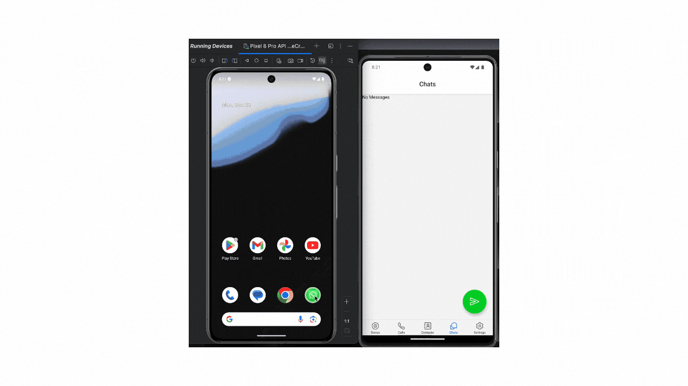

# WhatsappApp

💬 WhatsApp Clone (React Native)
Bu proje, React Native kullanılarak geliştirilmiş modern bir WhatsApp klonudur. Kullanıcılar gerçek zamanlı sohbet edebilir, medya paylaşabilir, kişi listesine erişebilir ve kullanıcı kimlik doğrulamasıyla giriş yapabilir.

🚀 Özellikler
🔐 Firebase Authentication ile kullanıcı kaydı ve girişi

🗣️ Gerçek zamanlı mesajlaşma (Firestore üzerinden)

🧑‍🤝‍🧑 Cihaz rehberinden kişi listesi çekme

📸 Fotoğraf seçme, kırpma ve yükleme (Firebase Storage)

💾 AsyncStorage ile lokal veri saklama

🧭 Tab & Stack navigasyon sistemi

🗓️ Mesaj zamanlarını moment ile biçimlendirme

